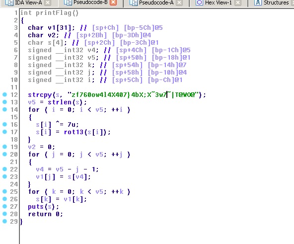

### FunMail2.0

This one was the Second Revsersing Challenge with 50 points
and like everytime i fireup the file to IDA to inspect things
and this sems like the first one , we have the username and password
hardcoded.

**strcpy(s2, "john galt");**

**.data:0000304C password        db 'more-secure-password',0 ; DATA XREF: main+14**

but when we use them (they are correct) but a kind of restriction get us out and exit
so i decided to look at the function wich show us the flag after getting to menu
and it was like this 

so i decided to made an implementation of the function to get the Flag
so i write the script [fun2.py](fun2.py) and the flag was :

**Flag : TUCTF{l0c4l_<_r3m073_3x3cu710n}**
